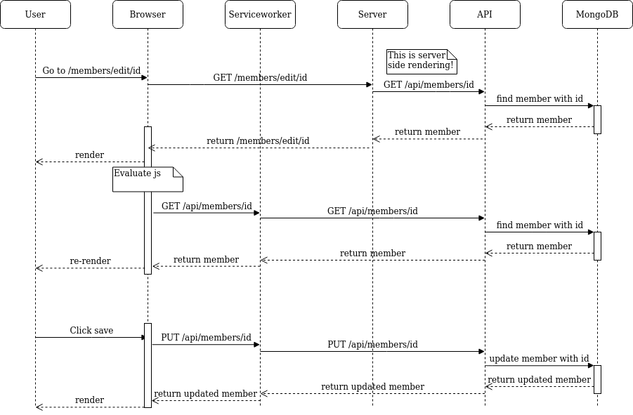
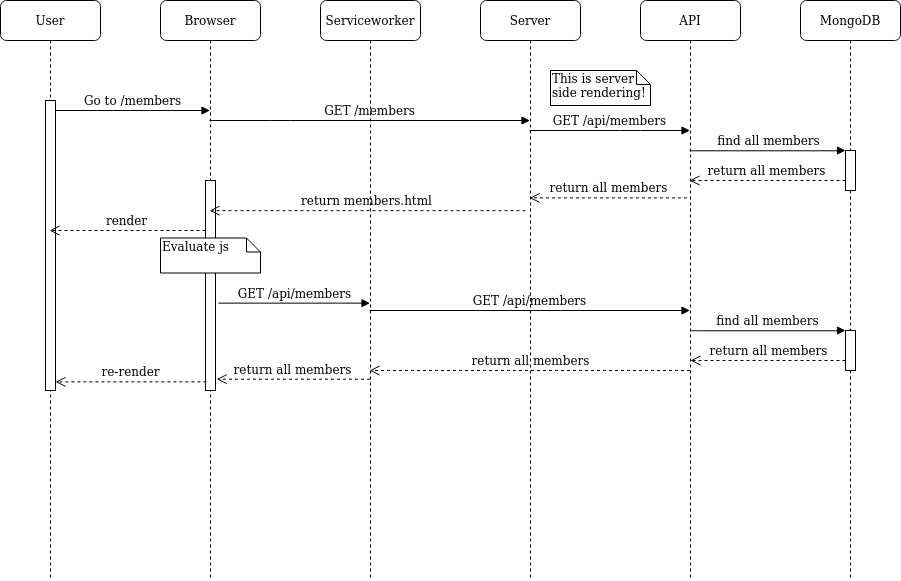

# akela
Ruben Hensen
s2084700

## Technische samenvatting
Akela draait op de volgende technologieen:
- Sapper (Svelte)
- MongoDB
- ExpressJS

## Project beschrijving
Akela is een webapplicatie voor het bijhouden van presentie voor een scouting vereniging.
Leden kunnen toegevoegd worden via de 'Members' pagina. Als de leden zijn toegevoegd kan daarna de presentie bij gehouden worden. Op de 'Cancellation' pagina kan de leiding leden afmelden. Op de 'Attendance' pagina wordt de daadwerkelijke presentie bij gehouden. De kinderen die zich af hebben gemeld komen hier niet tussen te staan, zodat de leiding weet dat deze niet aanwezig horen te zijn. Alle dingen die op de app worden gedaan worden automatisch opgeslagen zodra ze gebeuren. Als er een week voorbij is wordt alle presentie gearchiveerd. De nieuwe week heeft weer 0 afmeldingen en geen presentie zodat de volgende week bijgehouden kan worden.

Use cases:
De leiding moet leden kunnen toevoegen aan het systeem.
	Members > Add member > Save

De leiding moet leden kunnen bewerken in het systeem.
	Members > Edit (er moet eerst een lid aangemaakt worden) > Save

De leiding moet leden kunnen verwijderen uit het systeem.
	Members > Edit > Delete

De leiding moet alle leden kunnen bekijken.
	Members

De leiding moet leden kunnen afmelden.
	Attendance > Klik op het lid dat zich af meldt voor as zaterdag

De leiding moet tijdens het draaien presentie kunnen afnemen.
	Attendance > Klik op het lid als hij/zij aanwezig is.
	
De leiding moet hun eigen profiel kunnen zien.
	Profiel icoon rechtbovenin.
	
De leiding moet kunnen zien welk programma ze die dag draaien.
	Program.
	

## Testing
Alle componenten zijn getest met Jest. Deze manier van testen is meer zoals in de lessen zijn geleerd. Helaas heeft Sapper hier uit zich zelf geen ondersteuning voor en daarom breekt het op sommige punten ook. Sapper maakt een eigen node_modules map aan die Jest niet herkent. Alles wat hier uit geimporteerd wordt breekt ook de testen daardoor. Zo werkt register.svelte.js bijvoorbeeld niet omdat dit component {goto} from '@sapper' importeert. 

Meer info: https://github.com/sveltejs/sapper/issues/654

Deze testen kunnen gedraaid worden met npm run unit-test, maar zullen dus niet allemaal slagen.

Om deze reden heb ik voor alle testen cypress gebruikt. De testomgeving die bij sapper zit inbegrepen. Dit zijn de testen die gedraaid worden tijdens de CI.

## Sequence Diagrams
Sapper heeft iets wat een Angular of React applicatie standaard niet heeft en dat is server side rendering (SSR) en een service worker. De sequence diagrammen hieronder zijn gemaakt alsof de browser de url laad zonder ooit eerder op de pagina te zijn geweest. Zo kunnen we de SSR en de service worker in ieder geval zien zonder dat het te ingewikkeld wordt.

